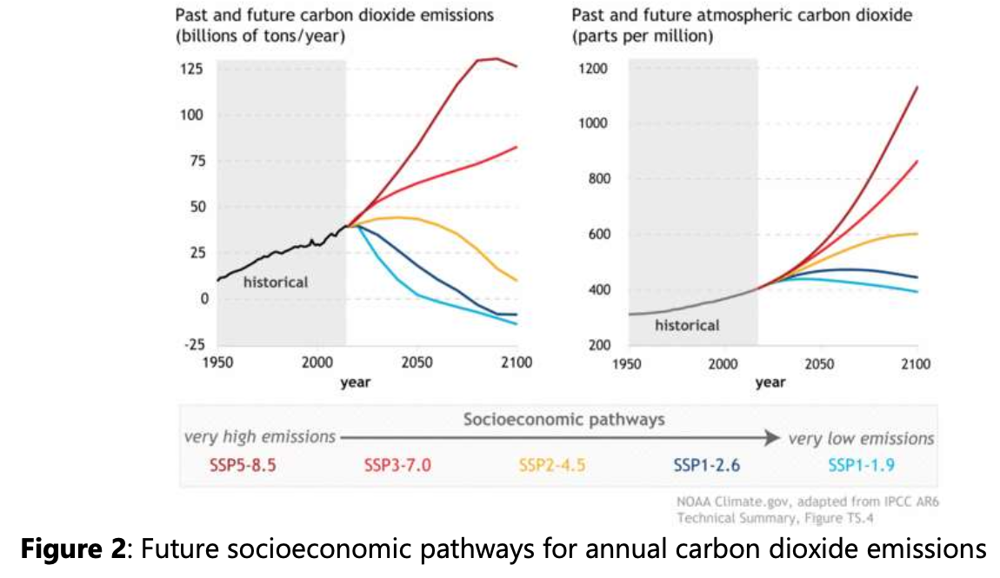

# AIAndBlockchainCabonCreditMarket:
## Carbon Emissions Overview

* Carbon emissions, specifically carbon dioxide equivalent, are a metric used to assess the potential global warming impact of emissions from various greenhouse sources. Carbon emissions from power systems can be quantified as carbon intensities or carbon emission fluxes(CEFs). Carbon intensities measure the amount of carbon emissions per unit of energy generated by considering the carbon content of fossil fuels and their efficiency. In the energy sector, centralized fossil fuel-based generation, such as coal, gas, and oil, primarily meets power demands. However, the burning of fossil fuels and energy losses during long-distance transmission result in substantial carbon emissions, contributing to air pollution and irreversible climate changes. To gain a comprehensive understanding of emissions by sector, carbon emissions must be quantified and analyzed.

## AI in Decentralized Carbon Markets
* In the realm of decentralized carbon markets, the presence of artificial intelligence(AI) is crucial as it enhances the intellectual capacity needed for making emission predictions, determining credit prices, and making trading decisions. The use of machine learning algorithms allows for the analysis of large datasets, the identification of patterns, and the ability to adapt to the constantly changing conditions of the market. Blockchain technology enables AI to gather and protect data from diverse sources, including clients, servers, and networks. To accumulate large amounts of data in a decentralized framework, a neural network can be deployed on a Blockchain network.

## Collaborative and Federated Learning
* Collaborative or Federated Learning involves training AI models locally on a variety of decentralized devices or clients, each with its own set of local data samples. Unlike centralized learning, data samples are neither transferred nor stored on a central server. In this approach, each iteration of Federated Learning involves five distinct steps. Firstly, the central server selects a statistical model and a group of nodes or clients. Subsequently, the chosen model is distributed to all selected nodes. Thirdly, clients train the model using their own local data. Fourthly, nodes submit any modifications made to the model back to the central server. Finally, the central server collects updates from all clients and integrates them into the original model. The updated model then continues to follow the same procedure with a new set of clients, perpetuating the cycle.

## Carbon Markets: Function and Challenges
* Carbon markets play a pivotal role in combating climate change by offering incentives to reduce emissions. Tradable carbon credits quantify a reduction in greenhouse gas emissions, generating economic value for environmentally conscious businesses (Wan et al., 2021). These markets serve as a platform where businesses and investors can engage in the trading of carbon credits and offsets.

* These markets facilitate the buying and selling of carbon credits, allowing companies to offset their emissions or trade credits. Enterprises and individuals can utilize carbon markets to reduce their greenhouse gas emissions by purchasing carbon credits from organizations that actively reduce or eliminate them. Traditional carbon markets have encountered challenges such as inefficient processes, opaque operations, and the risk of double-counting. By integrating blockchain technology and artificial intelligence, these hurdles can be overcome.
