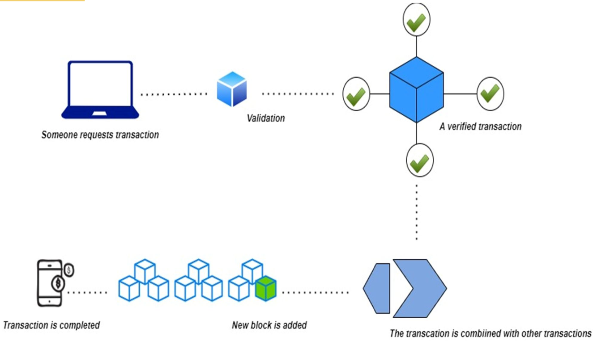
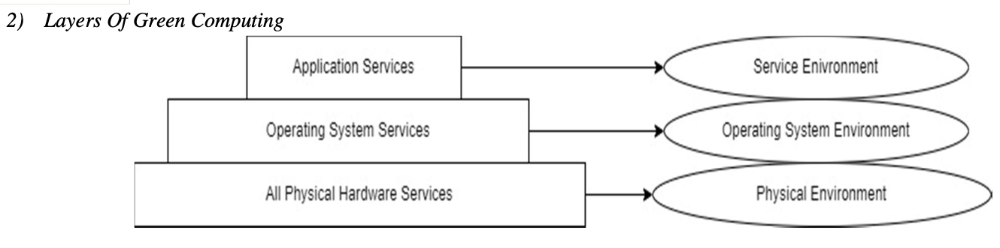

# AugmentationOfBlockchainAnd5GInGreenComputing:

## Visualization of Key Concepts

## Introduction to Green Computing and Blockchain
* Green Computing focuses on using energy efficiently to perform tasks in the most environmentally friendly way. As energy costs increase and environmental concerns grow, green computing is gaining more attention. Blockchain is becoming popular for its decentralized, peer-to-peer, transparent ledger systems.

## Benefits of Green Computing
* Green Computing, a powerful field, enables computing devices to consume up to 150-200% less energy compared to traditional computing systems. It involves designing, manufacturing, using, and disposing of computing devices in a manner that minimizes their harmful environmental impact. Green Computing focuses on optimizing energy usage to perform operations as efficiently as possible.

## Blockchain Types and Structure
* Current blockchain networks can be categorized into three types: **public, private, and consortium blockchain**.
  * A public blockchain is permissionless, allowing anyone to participate in the network. It is publicly accessible for individuals to read, write, and validate transactions without the approval of third parties.
   * A private blockchain is centralized and only approved members can participate.
    * Blockchain structure:
      * A blockchain is a chain of blocks linked together by a hash.
      * The hash depends on both the new transaction and previous transactions.
      * To verify a transaction, miners require a digital signature to certify its authenticity and integrity.
      * The blockchain utilizes the Elliptic Curve Digital Signature Algorithm to sign transactions.
      * Once miners approve a transaction, it is recorded in a block.
      * A block is added to the chain when consensus is reached and it contains a specific number of verified transactions.
      * Each block references the previous block, forming the blockchain.