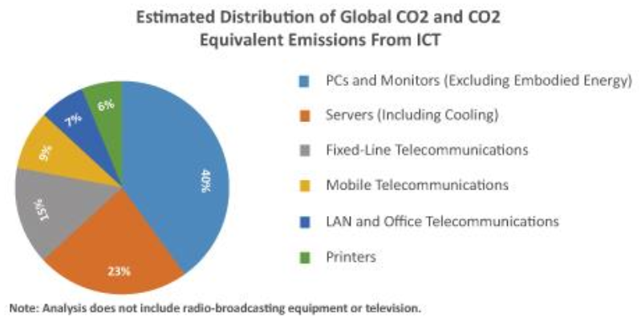

# EvaluationOfGreenAlternativesForBlockchainProof-of-WorkApproach

<!-- Note: Replace the above URL with your actual image URL -->

## Environmental Impact of ICT

- One significant drawback is the carbon footprint generated by the ICT sector, primarily stemming from the exponential increase in energy consumption throughout its lifecycle. As per the U.S. Environmental Protection Agency, electricity production and the transportation sector collectively accounted for approximately 28% of the total greenhouse gas emissions in 2016, while the industry, residential and commercial sectors, and agricultural sectors contributed 22%, 11%, and 9%, respectively.

- In 2015, Chinnadurai reported that the ICT sector accounted for approximately 2% of the total carbon footprint. Although this percentage may seem insignificant, it translates to 0.86 billion tons of carbon emissions, which is projected to rise to 4% by 2020.

## Green Computing

- Green computing primarily involves using computing resources in an environmentally friendly and responsible manner. It encompasses a broader range of concepts, including the study and practice of various aspects relevant to environmentally sustainable computing or IT. These include designing, engineering, manufacturing, disposing of, and using computing resources in ways that minimize their overall environmental impact. 

- The concept of green computing was officially introduced by the U.S. Environmental Protection Agency in 1992. This was achieved through the launch of Energy Star, a government-backed voluntary labeling program. Energy Star was designed to promote and recognize energy efficiency in electronic and electrical devices, including computing resources such as home appliances and industrial equipment.

## Blockchain Types

- There are two main types of blockchains in terms of access: permissionless(public) and permissioned(private). In a permissionless blockchain network, any internet-enabled device can act as a participating node with write and read access to the chain of blocks, which contains the data. On the other hand, in a permissioned blockchain ecosystem, participation is restricted to nodes that have been granted permission by the protocol code. Only certain nodes are allowed to write, while most other permitted nodes have read access. 

## Proof-of-Work (PoW) Mechanism

- In a permissionless blockchain network like Bitcoin, a willing participant initiates a transaction by broadcasting it to the network. Subsequently, other network participants verify and validate the transaction, adhering to the protocol's rules. These verified and validated transactions are pooled into a group of "unconfirmed" transactions. Subsequently, a subset of all transactions, or an asymmetrically selected group, is combined into a "candidate" block by participating nodes.

- Alongside other pertinent information, a "coinbase" transaction and a nonce are added before calculating the "hash" of the candidate block. Unlike ordinary transactions, a coinbase lacks an input transaction number or address (pointer) – it's a new transaction that creates fresh coins, following the latest reward rate defined by the protocol, with an output to the participating node vying for the successful generation of the block. This serves as an incentive for the competing node. Similarly to gold mining, this process is also referred to as (cryptocurrency) mining, and the competing nodes are known as miners.

- To successfully release (or acquire) the newly created coins, which currently reward 12.5 Bitcoins (BTC) as of March 2019, the calculated hash must meet specific criteria, particularly the difficulty level. The difficulty level serves as a threshold, indicating the minimum hash value required. In other words, the calculated hash must begin with a certain number of zeros. To achieve this, a brute force approach is employed. This involves repeatedly calculating the hash by incrementing the value of the nonce, typically by one, until the threshold is met. Once the threshold is achieved, the block is securely sealed and transmitted to the network for consensus validation. Subsequently, other nodes verify the claim and, if satisfied, incorporate it into their existing chain of blocks. This process initiates the construction of a new candidate block.

- The entire process is known as Proof-of-Work (PoW), where miners must exert effort by utilizing their computing power and consuming electric energy.

## Environmental Concerns

- In November 2017, Malmo reported that a single Bitcoin transaction consumes an average of 215 KWh, which is equivalent to the average household electricity consumption in a week. As of March 21, 2019, Bitcoin's electricity consumption accounts for a mere 0.23% of the world's total electricity consumption. However, this share has nearly doubled within the past 1.5 years.

- As of early 2021, the estimated annual e-waste generated by Bitcoin was 64.4 metric kilotons.

- Smart-contracts, ICOs(Initial Coin Offerings), DAOs(Decentralised Autonomous Organizations), and DApps(Decentralised Apps) have gained immense popularity due to their multifaceted applications, particularly those offered by Ethereum and other similar blockchain technologies.

## Alternative Consensus Mechanisms

### Proof of Stake (PoS)

- After Proof of Work(PoW), Proof of Stake(PoS) has garnered the highest level of attention from developers and researchers. Unlike PoW, which relies on an open completion mechanism, PoS introduces a selection process to determine the next block's creator. This process primarily involves the amount of coins or wealth(stake) a node holds, in conjunction with other selection algorithms like randomized block selection and coin age-based selection. While PoS offers greater environmental friendliness, the higher the stake a node possesses, the greater its chances of selection, potentially leading to a form of centralization.

### Delegated Proof of Stake (DPoS)

- Delegated Proof-of-Stake(DPoS) is a variation of Proof-of-Stake(PoS) that has gained significant attention and been implemented in various projects. Unlike PoS, DPoS selects a limited number of nodes with the authority to propose and validate blocks for addition to the existing chain. This approach results in faster consensus formation compared to PoS and PoW, leading to a reduced environmental impact.

### Proof of Activity (PoA)

- Proof-of-Activity(PoA) is a hybrid of both Proof-of-Work(PoW) and Proof-of-Stake(PoS). It initially employs PoW to select a "miner" responsible for creating a block. This block contains only the relevant head information and the miner's address, excluding transactions. After the PoW phase is successfully completed, PoA selects the signing nodes(validators) using PoS. Unlike PoW and PoS, transactions are then added to the block. Once the transactions are validated and signed by the validators, they are incorporated into the existing block. The mining rewards are proportionately shared among the PoW miner and PoS validators, based on their contributions and roles. Consequently, PoA shares the same energy consumption requirements as PoW during the PoW phase. Additionally, it inherits the risk of centralization associated with PoS.

### Proof of Capacity (PoC)

- Proof-of-Capacity(PoC), also known as Proof of Space, selects miners based on the amount of disk space filled with plots. These plots are pre-recorded probable "nonce" values generated through iterative hashing of data. Similar to Proof of Stake(PoS), the more disk space plotted, the higher the chance of winning. However, unlike Proof of Work(PoW), PoC is considered more environmentally friendly. It can be performed with regular computing resources without the need for performance-enhancing devices like ASICs. Moreover, the upfront computational cost of the plotting process is significantly lower than solving a PoW puzzle. Unlike PoW, miners can reuse their existing plots repeatedly, reducing the running cost(power consumption) and making PoC not only eco-friendly but also economical.