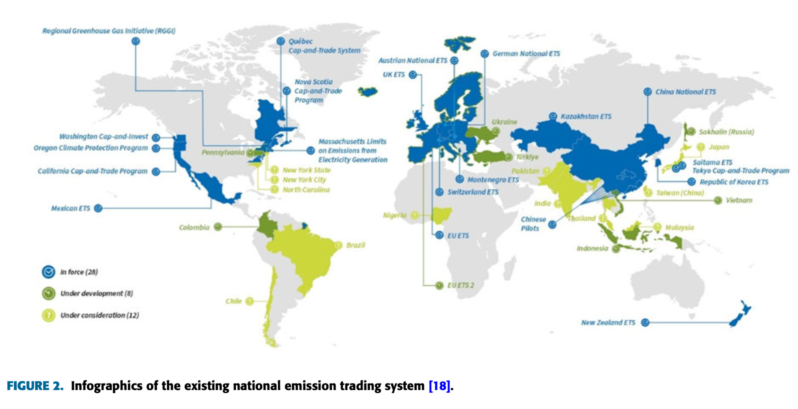
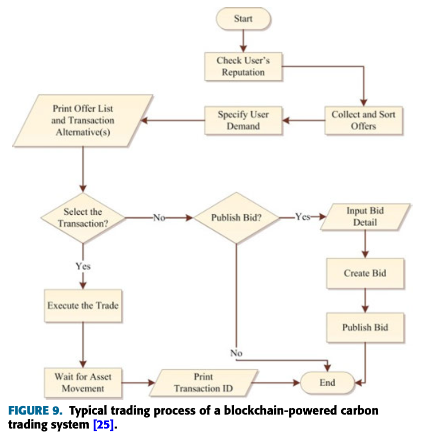
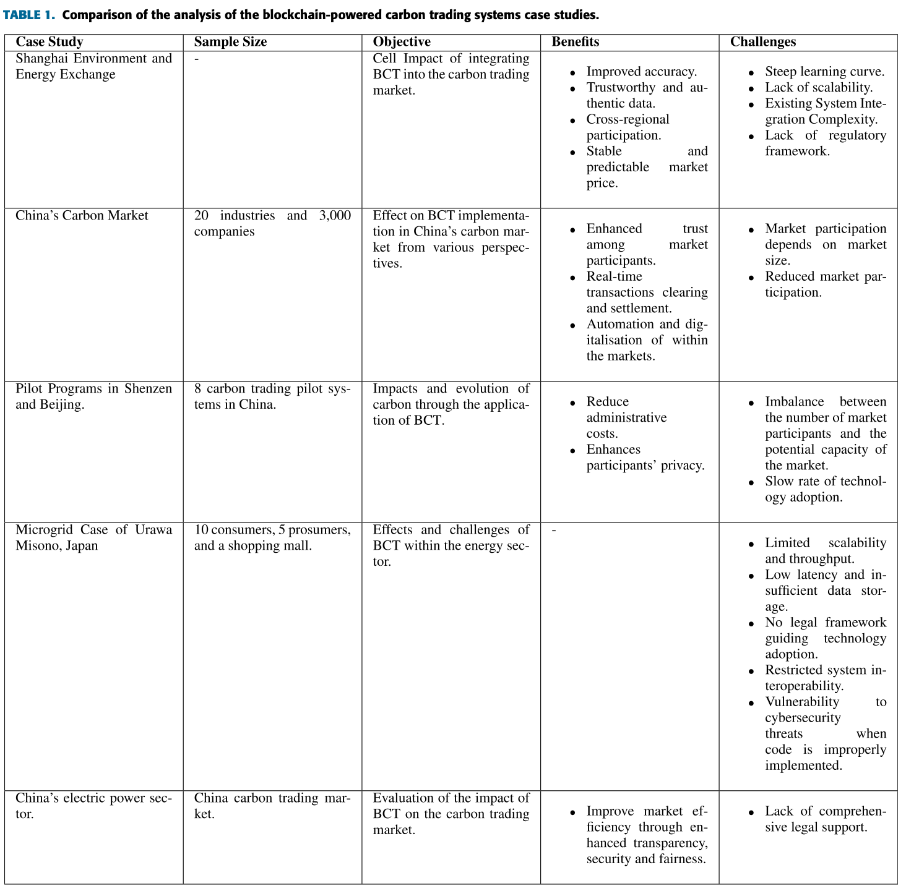

# Application of Blockchain Technology in Carbon Trading Market

## History of Carbon Credit System

### Origins and Foundations
- **Carbon Trading Concept**: A mechanism that regulates carbon dioxide emissions through carbon caps and taxation
- **Kyoto Protocol Impact**: Established in 1997, strengthened the trading system by allowing the exchange of carbon emission rights for financial compensation
- **Definition**: Carbon trading is the exchange of greenhouse gas (GHG) emission rights for monetary rewards within a market framework aimed at reducing emissions

### Key Milestones and Development

#### Early Foundations (1990s)
- **1991**: European Union introduced carbon taxation mechanisms
- **1997**: United Nations established the Carbon Trading System (CTS) through the Kyoto Protocol

#### Expansion Period (2000-2009)
- **2001**: United States withdrew from the Kyoto Protocol
- **2002**: United Kingdom established its Emission Trading System (ETS)
- **2004**: Russia ratified the Kyoto Protocol, providing full legal implementation
- **2005**: European Union Emission Trading System (EU ETS) launched, becoming the world's largest ETS
- **2008**: New Zealand implemented its national ETS
- **2009**: Regional Greenhouse Gas Initiative (RGGI) formed, covering emissions in northeastern US states

#### Global Adoption (2010-Present)
- **2010**: Japan introduced its ETS framework
- **2012**: South Korea launched comprehensive national ETS
- **2013**: China began regional carbon trading pilot programs
- **2019**: South Africa implemented carbon tax mechanisms
- **2021**: China established its national ETS, becoming the world's largest by volume

### Market Growth and Valuation

The global carbon market has experienced significant expansion since its inception:

#### Historical Growth
- **2005**: Initial market valuation of $10.9 billion
    - Established with approximately 8% annual growth rate

#### Current Status
- **2023**: Market value reached $95 billion
    - Representing nearly 9x growth from initial valuation

#### Future Projections
- **2030**: Expected to reach $100 billion
- **2050**: Projected expansion to $250 billion
    - Indicating continued long-term market maturation

## Current Implementation Status

### European Union Emission Trading System (EU ETS)
- **System Status**: Currently in Phase 4 (2021-2030)
- **Coverage**: 
    - 10,000+ power plants and industrial facilities
    - Spans 27 EU member states plus Iceland, Liechtenstein, and Norway
- **Operational Model**:
    - Allocates carbon credits to participating entities
    - Monitors emission rates against allocated allowances
    - Provides financial incentives for emission reductions
    - Imposes carbon tax on entities exceeding their allocations
    - Tax revenues fund environmentally friendly initiatives

### Global Carbon Trading Landscape
- **Active Systems**: 28 national and regional ETS schemes currently operational
- **Development Status**:
    - 8 nations in active development phase
    - 12 countries considering implementation
- **Regional Adoption**:
    - Limited implementation across African continent
    - Nigeria exploring potential carbon trading frameworks

## Existing Carbon Trading Systems

### Global Adoption and Distribution
- **System Proliferation**: Following the European Trading System (ETS), multiple national and regional systems have emerged
- **Geographic Spread**: 
    - Established in China, Mexico, France, Sweden, and other nations
    - Notable absence of systems across the African continent
- **Implementation Status**:
    - 28 national and regional ETSs fully operational
    - 8 nations in active development phase
    - 12 countries considering implementation
    - Nigeria is the only African country contemplating national ETS

### EU ETS Impact and Scale
- **Population vs. Emissions Ratio**: 
    - Comprises one-third of global population
    - Accounts for only 17% of worldwide greenhouse gas emissions
- **Emission Reduction**: Achieved 20% reduction in emissions during 2020s compared to 1990s levels

### Working Principles and Challenges

#### Operational Framework
- **Core Mechanism**: Based on Monitoring, Reporting, and Verification (MRV) of emission values

#### System Limitations
- **Transparency Issues**: 
    - Lack of trust and transparency in existing centralized systems
    - Questions regarding validity of reserved carbon credits
- **Structural Weaknesses**:
    - Increased risk of manipulation and fraud
    - Carbon leakage preventing accurate value accounting
    - Complex trading patterns
    - High transaction costs

#### Market Consequences
- **Participation Barriers**: Low engagement in incentivized trading system
- **Economic Impact**: 
    - Reduced market liquidity
    - Inappropriate price fixing mechanisms

### Disadvantages of Existing Systems

- **Exclusion of Small Emitters**: The current carbon market design doesn't accommodate smaller emitters, as it's predominantly dominated by large entities. This exclusivity creates operational ambiguity, restricting participation and hindering competition and innovation among local initiatives.

- **Manual Reporting Flaws**: Reliance on manual emissions reporting introduces human error risks, potentially leading to inaccurate emission records. The absence of automated systems prevents real-time assessment of net-zero carbon targets and creates opportunities for data manipulation that compromises credibility.

- **Economic Burden Transfer**: Carbon taxes or quota purchase requirements increase production costs for emitting entities. Manufacturers must account for these added expenses alongside existing costs, typically passing the financial burden to end consumers through inflated product prices.

- **Fraudulent Activities**: The system suffers from integrity issues including recycling of certified emission reductions (CERs) and issuance of non-additional offset credits after transactions. These officially assigned credits lose their ability to provide additional emission reduction, rendering them redundant.

## Overview of Blockchain Technology

Blockchain technology represents a revolutionary approach to data management and transaction processing that offers significant advantages for carbon trading systems.

### Characteristics of Blockchain Technology

- **Decentralization**: No central authority, thereby preventing single point of failure.

- **Transparency & Privacy**: All participating nodes can view information regarding transactions accessible to them without compromising the privacy of the contractual terms.

- **Data Security**: Blockchain offers encrypted security, ensuring transaction protection for both parties involved in the system, guaranteeing process integrity.

- **Smart Contracts**: Enable the system to operate autonomously, eliminating the need for third-party escrow. Once agreement terms are fulfilled, they trigger specific actions based on predefined conditions.

- **Safe and Reliable**: The distributed ledger ensures that each transaction among network participants is accurately recorded in a shared ledger. Since a consensus network is established, any issues within a transaction link can be directly identified and traced.

- **Efficiency and Convenience**: All network entities adhere to the same protocol, ensuring compliance with a shared consensus algorithm. Blockchain automatically validates transactions and continuously updates optimal trading routes and schedules based on historical data. Elimination of intermediaries simplifies and enhances network efficiency.

- **Inclusivity**: Small and Medium Enterprises (SMEs) can easily participate as blockchain doesn't impose size restrictions for market entry. This is crucial considering SMEs collectively have a more significant environmental impact than larger entities (e.g., in 2010, SMEs in China were responsible for 53% of the country's carbon emissions).

- **Distribution**: All participating nodes have a real-time copy of all updated records, eliminating single points of failure or vulnerability to attacks.

- **Traceability and Auditability**: Blockchain maintains a comprehensive historical record of all transactions and actions performed on subsequent blocks from inception.

- **Cost Reduction**: Blockchain-based systems enhance operational efficiency by reducing required human agents and execution time, lowering transaction costs and simplifying oversight and management for governmental and inspection agencies.

### Consensus Mechanisms

- **Proof of Work (PoW)**: A consensus protocol commonly employed in distributed ledgers to validate nodes. It utilizes the Secure Hash Algorithm 256 (SHA-256) to secure all network blocks. Its primary drawback is significant resource consumption, particularly electricity.

- **Proof of Stake (PoS)**: The entity's stake in the system, specifically in terms of coin ownership, determines the possibility of creating or adding blocks. A notable vulnerability is the potential for instantaneous creation of multiple blocks on the chains.

- **Delegated Proof of Stake (DPoS)**: Enables token holders to elect trustworthy delegates to represent their voting rights. More effective than PoW and PoS due to reduced energy requirements for transaction validation.

- **Byzantine Fault Tolerance (BFT)**: Named after the Byzantine General's decision puzzle. Employs hashes, digital signatures, and metadata in its consensus algorithm. Used by Hyperledger Fabric, it reduces system overhead and enhances execution speed while making hacking more challenging.

- **Delegated Proof of Reputation (DPoR)**: Enhances DPoS by improving system security. Voting power is calculated based on carbon reduction contributions of emitting enterprises. Higher reputation values grant greater influence, with reputations derived from voting outcomes and recent interactions.

- **Federated Byzantine Agreement (FBA)**: Allows network entities to validate transactions approved by their trusted validators, relying on a minimal number of trustworthy validators chosen by network entities.

- **Proof of Authority (PoAu)**: Proposed by Ethereum co-founder Gavin Wood, it requires authorization of predetermined members to update information in the distributed ledger, adopting a more centralized approach for streamlined chain management.

- **Proof of Elapsed Time (PoET)**: Validators set waiting periods for each entity across the network. Entities enter a dormant state and are reactivated in ascending order of their assigned waiting times.

- **Proof of Activity (PoA)**: Combines features of both PoW and PoS mechanisms. Blocks must undergo PoW verification followed by PoS verification before being added to the blockchain.

- **Proof of Burn (PoB)**: Entities must transfer specific amounts of coins to an escrow wallet to add blocks. Larger holdings increase the likelihood of successfully adding blocks, with deposited funds becoming permanently inaccessible.

- **Proof of Capacity (PoC)**: Utilizes available storage capacity of a disk, allowing entities to compile comprehensive lists of possible block hashes beforehand, reducing computational time.

- **Proof of Importance (PoI)**: Evaluates block significance based on transaction quality and the entity's reputation within the network before adding blocks to the blockchain.

## Benefits of Blockchain Integration in Carbon Trading

- **Market Transparency**: Blockchain technology significantly enhances the transparency and traceability of transactions and actions within the carbon market. By integrating blockchain into carbon trading markets, the market gains an immutable and auditable ledger, influencing the behavior of market participants and improving the accountability of records accessible to all participants.

- **Trustworthiness**: The blockchain-powered emissions trading system enhances trust among market participants. It assures them that the system is less susceptible to human manipulation and transactions are not dependent on any centralized authority.

- **Liquidity of the Carbon Market**: The liquidity of the carbon market is facilitated by blockchain technology, simplifying the processes of buying and selling carbon quotas and converting them into cash. This is achieved because blockchain enables small and medium-sized emitting entities to trade independently of larger entities, leading to a highly liquidized trading system that operates without the risk of manipulation by 'big players' through centralization.

- **Reduced Administrative Costs**: Integrating blockchain into carbon trading offers a substantial advantage in terms of reduced administrative costs. The system operates automatically and utilizes smart contracts, ensuring decentralization, distribution, and automation.

- **Enhanced Accountability**: Blockchain's immutable nature ensures robust accountability in the carbon trading market, preventing double counting of emissions quotas.

- **Enhanced Security**: Powering carbon markets with blockchain technology significantly enhances the security of the market. The encryption mechanisms employed in blockchain-powered carbon markets are based on advanced cryptographic techniques, ensuring that data remains highly secure and resistant to unauthorized alterations. Moreover, transacting in a blockchain-driven carbon trading market necessitates verification and authorization through digital signatures, effectively preventing unauthorized parties from initiating or validating information.

## Challenges of Blockchain Integration in Carbon Trading

### Regulatory Framework Limitations
- Different blockchains employ diverse consensus mechanisms, significantly impacting operational efficiency
- No standardization of rules or regulations across national, regional, continental, and global levels
- Lack of consensus on appropriate mechanisms to be employed
- Need for protocols to ensure data encryption, anonymization, and access control

### Privacy Concerns
- Stakeholder hesitation due to blockchain's decentralized, immutable, and publicly accessible nature
- Potential deterrent to market participation
- **Possible solutions**:
    - Adopting consortium blockchain networks or hybrids of private and public blockchains
    - Implementing privacy-enhancing technologies like Zero-Knowledge Proofs (ZKPs)

### Scalability Issues
- Existing blockchain networks struggle with scalability, latency, and throughput
- Challenges with handling continuous data from IoT sensor devices
- Example: Hyperledger Fabric can handle only 150 transactions per second with minimal latency
- **Potential solutions**:
    - Layer-2 scaling solutions like rollups and sidechains
    - Network partitioning into smaller, parallel chains (shards)
    - IoT-specific blockchain networks like IOTA powered by Directed Acyclic Graphs (DAGs)

## The Blockchain-Based Carbon Trading Process

### How the Trading System Works

The diagram above illustrates the typical trading process in a blockchain-based carbon trading system, which operates through the following sequence:

1. **Initial Offer Collection**
    - Buyers begin by collecting available offers from Sellers
    - Access to offers is determined by the Buyer's reputation and system usage history

2. **Reputation Verification**
    - The system authenticates the Buyer's reputation
    - Verification grants appropriate level of access to the marketplace

3. **Offer Prioritization**
    - Available offers are automatically sorted according to their Priority Values (PVs)
    - Higher-ranked offers appear first in the Buyer's selection list

4. **Selection Process**
    - Buyers select top-ranked offers first
    - If initial offers don't fulfill requirements, Buyers proceed to subsequent offers
    - Process continues until requirements are met or list is exhausted

5. **Alternative Actions**
    - When no satisfactory offers exist, Buyers can:
      - Wait for new offers to appear
      - Publish their own bid to the marketplace

6. **Binding Agreements**
    - **Important**: All published offers and bids are legally binding
    - Once selected by the counterparty, the initiator cannot withdraw

7. **Market Mechanics**
    - The system operates on a protocol combining:
      - Market segmentation (price-based)
      - Priority value ordering
    - These factors determine the final position of bids visible to all parties

## Case Studies of Blockchain Carbon Trading Implementation

### Comparative Analysis Framework

Before examining specific implementations, it's important to understand how different blockchain solutions compare across key metrics. The following analysis evaluates notable carbon trading blockchain projects based on:

- **Technical Parameters:**
    - Consensus mechanisms employed
     - Scalability capabilities
     - Technological maturity level

- **Market Integration:**
    - Integration approach with existing systems
    - Compatibility with regulatory frameworks
    - User adoption strategies

 - **Performance Metrics:**
    - Emission reduction efficacy
    - Transaction throughput
    - Governance structures

These comparative metrics help stakeholders identify which blockchain implementations best address the specific challenges of carbon trading markets while delivering maximum transparency and efficiency benefits.
