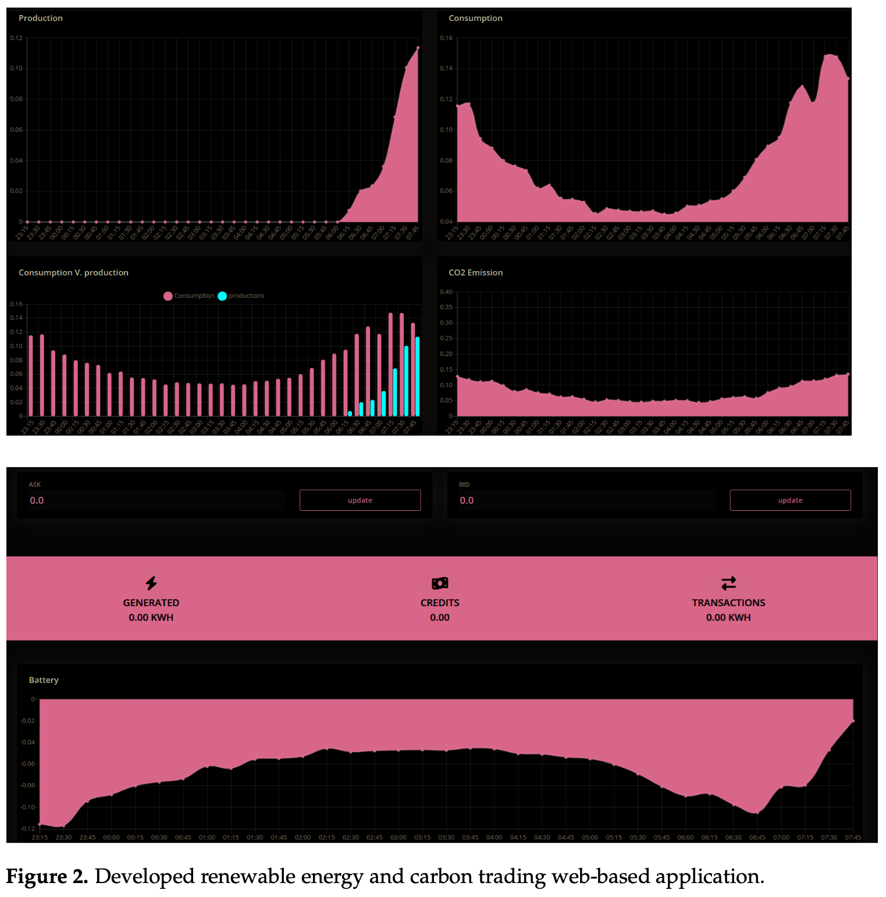

# BlockchainIOT For Carbon Exchange

## Real-World Applications and Case Studies

In the emerging field of blockchain-IoT integration for carbon markets, several organizations are pioneering innovative solutions:

### ClimateChain
- A collaborative effort involving various organizations
- Dedicated to developing a blockchain-based platform for carbon credit trading
- Mission: Enhance transparency and efficiency in the carbon credit sector

### Veridium
- Blockchain-based platform for carbon emissions verification
- Meticulously tracks and verifies carbon emissions data from Internet of Things (IoT) devices
- Guarantees data authenticity and effectively prevents fraudulent activities

### Climate Collective
- Blockchain-based platform connecting stakeholders with carbon offset projects
- Enables individuals and businesses to actively participate in climate action
- Facilitates engagement in carbon offset initiatives

## Carbon Emissions Framework

The following framework provides a structured approach for calculating carbon emissions, rewards, and penalties based on electricity consumption. This system incentivizes consumers to reduce their electricity consumption and carbon footprint.

### Carbon Calculation Parameters

- **Emission Factor (EF)**: 0.6 kg CO2e per kWh
- **Reward System**: Monetary incentives for reduced consumption
- **Penalty System**: Charges applied for consumption exceeding 1000 kWh

### Consumption-to-Emissions Conversion Table

| Consumption Range (kWh) | Carbon Emissions (kg CO2e) | Reward (USD) | Penalty (USD) |
|-------------------------|----------------------------|--------------|---------------|
| 0-100                   | 0-60                       | 0.00         | 0.00          |
| 101-200                 | 61-120                     | 0.20         | 0.00          |
| 201-300                 | 121-180                    | 0.40         | 0.00          |
| 301-400                 | 181-240                    | 0.60         | 0.00          |
| 401-500                 | 241-300                    | 0.80         | 0.00          |
| 501-600                 | 301-360                    | 1.00         | 0.00          |
| 601-700                 | 361-420                    | 1.20         | 0.00          |
| 701-800                 | 421-480                    | 1.40         | 0.00          |
| 801-900                 | 481-540                    | 1.60         | 0.00          |
| 901-1000                | 541-600                    | 1.80         | 0.00          |
| Above 1000              | >600                       | 0.00         | 2.00          |

### Reward and Penalty System

#### Reward Structure
- Designed to encourage consumers to stay within lower consumption ranges
- Rewards increase linearly with consumption up to a threshold of 1000 kWh
- Promotes reduction of electricity usage
- Aligns economic incentives with environmental benefits

#### Penalty Structure
- Simple approach: consumption above 1000 kWh incurs a penalty of USD 2.00
- Acts as a deterrent against high electricity usage
- Encourages adoption of energy-saving measures

#### System Benefits
- Drives behavioral change toward more sustainable energy consumption
- Provides financial rewards for lower consumption
- Imposes penalties for excessive use
- Aligns individual economic incentives with broader environmental goals

## Carbon Credit Exchange Platform

### Platform Features

#### Blockchain-Based Energy Tokenization
- Leverages Ethereum blockchain technology
- Converts energy into digital assets (energy tokens)
- Enables seamless exchange between producers and consumers
- Eliminates intermediaries for true peer-to-peer trading
- Significantly reduces transaction costs

#### Smart Contract Integration
- Automates the entire energy trading process
- Ensures transparency, security, and efficiency
- Eliminates manual verification requirements
- Reduces risk of fraudulent activities

#### Utility Collaboration
- Recognizes utilities' role in providing grid infrastructure
- Actively engages utilities as providers, sellers, and buyers
- Creates a collaborative ecosystem benefiting all stakeholders

#### Advanced Analytics
- Includes forecasting and optimization tools
- Enables prediction of energy demand and supply
- Helps users optimize energy consumption and minimize costs
- Provides real-time data visualization
- Delivers insights into energy usage and trading patterns