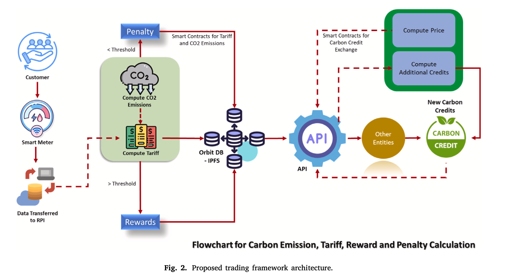
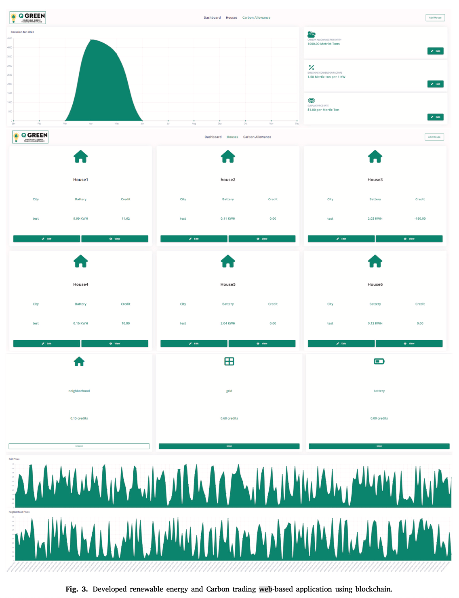

# Leveraging Blockchain Technology

## Carbon Trading and Blockchain Implementation

### Carbon Trading Overview

Carbon trading is a market-based mechanism aimed at mitigating greenhouse gas emissions by establishing a price on carbon pollution. Entities emitting greenhouse gases can purchase credits from entities that reduce emissions, creating financial incentives for emission reductions.

#### Established Carbon Trading Systems

- **European Union Emissions Trading System (EU ETS)**
    - Launched in 2005
    - World's first and largest carbon trading system
    - Covers approximately 45% of the EU's greenhouse gas emissions
    - Sets a cap on emissions from specific industries

- **California Cap-and-Trade Program**
    - Initiated in 2013
    - Covers approximately 85% of California's greenhouse gas emissions
    - Managed by the California Air Resources Board (2023)

### Current Challenges in Carbon Trading

One prevalent issue is **double counting**, where emissions reductions are claimed multiple times by different entities, leading to inflated credit issuance and a misrepresentation of actual emission reductions. Another significant concern is **fictitious emissions reductions**, where credits are generated without any actual reduction in emissions.

These fraudulent practices can be quantified using various metrics:
- **Emissions Reduction Factor (ERF)**: Represents the amount of emissions reduced per unit of credit issued
- **Carbon Leakage Factor (CLF)**: Measures the amount of emissions transferred to other sectors or regions

#### Lack of Transparency and Traceability

The lack of transparency and traceability in carbon credit markets poses significant challenges to verifying the validity and effectiveness of emission reduction projects. This erodes the integrity of the carbon market, making it challenging to ensure the credibility of emission reduction efforts.

**Key Requirements:**
- **Transparency**: Disclosure of relevant information about carbon projects, including methodology and performance data
- **Traceability**: Tracking the flow of carbon credits from their origin to final use

**Resulting Problems:**
- **Greenwashing**: Companies claiming emission reductions without meaningful operational changes
- **Double Counting**: Multiple issuance of credits for the same emission reductions
- **Fraud**: Illegal trading of carbon credits

## Proposed Blockchain-Based Framework

### Key Components
- **User Authentication and Registration**: Digital identities ensuring secure platform access
- **Issuance and Tracking of Carbon Credits**: Tamper-proof blockchain records of ownership and transactions
- **Smart Contracts**: Automated transactions and regulatory compliance enforcement
- **Real-Time Monitoring and Reporting**: Transparent tracking of emissions and trading activity

### Technical Architecture

The framework utilizes a decentralized network (such as Ethereum) where all participants can verify and validate transactions without relying on a central authority. This decentralization enhances trust by minimizing single points of failure and reducing vulnerability to tampering. Data integrity is maintained through consensus mechanisms like Proof-of-Work (PoW) or Proof-of-Stake (PoS), establishing agreement on transaction validity across the network.

## Economic and Environmental Impact Assessment

### Cost-Benefit Analysis
A cost-benefit analysis should assess the financial implications of blockchain in carbon trading. Key costs include technology infrastructure, implementation, and ongoing maintenance. Benefits may include increased trading volume, reduced transaction fees, and improved carbon accounting accuracy. A study by the World Bank (2021) estimated that blockchain could reduce transaction costs by up to 90%.

### Economic Impacts on Stakeholders
Blockchain can impact various stakeholders in the carbon trading market:
- **Governments**: May benefit from enhanced tax revenues and improved environmental regulation
- **Companies**: Can increase competitiveness by reducing carbon emissions and accessing new markets for carbon credits
- **Consumers**: May benefit from lower energy costs and improved air quality

### Environmental Benefits
Blockchain can significantly enhance environmental outcomes. By providing a tamper-proof ledger, it improves the accuracy of carbon accounting, reducing the risk of fraud and double-counting. This leads to enhanced emission reductions and more effective climate change mitigation. A study by the University of Cambridge (2022) found that blockchain could increase the efficiency of carbon trading by up to 50%.

## Three-Layer Carbon Trading System

Our proposed blockchain-based three-layer carbon trading system offers a novel and potentially transformative approach to managing carbon emissions and promoting sustainability.

### Layer 1: Carbon Emission Monitoring and Verification

This foundational layer is responsible for accurately capturing and verifying carbon emissions data.

- **Data Collection Sources**
    - IoT sensors for real-time emissions monitoring from industrial facilities and power plants
    - Satellite imagery for analyzing land-use changes and deforestation
    - Existing emission reporting systems to ensure data consistency and accuracy

- **Verification Methods**
    - Blockchain technology for data immutability and transparency, preventing manipulation
    - Smart contracts for automated verification protocols and data validation
    - Reduced reliance on manual audits through automated systems

### Layer 2: Carbon Emission Trading Platform

This layer serves as the central hub for carbon emission trading, leveraging blockchain technology to create a secure and transparent marketplace.

- **Core Functionalities**
    - Carbon credit issuance based on verified emission reductions
    - Secure ownership tracking and transfer of carbon credits
    - Regulatory compliance integration with existing environmental policies
    - Carbon offset project facilitation connecting emission producers with reduction projects

### Layer 3: Carbon Emission Reduction Incentives and Funding

This layer focuses on creating financial incentives for reducing carbon emissions through various mechanisms.

- **Financial Mechanisms**
    - Carbon pricing systems including carbon taxes and cap-and-trade frameworks
    - Government subsidies for businesses implementing emission reduction technologies
    - Investment funding frameworks to attract private capital for carbon reduction activities
    - Financial support for innovative green technologies and projects

### System Benefits

- **Transparency and Traceability**
    - Immutable blockchain records reduce fraud risk and double-counting
    - Complete transaction history providing audit trails
    - Enhanced trust among all stakeholders in the carbon market

- **Efficiency Improvements**
    - Automated verification through smart contracts reducing administrative burden
    - Streamlined administrative processes lowering operational costs
    - Elimination of intermediaries in carbon credit transactions

- **Market Improvements**
    - Increased participation through decentralization and accessibility
    - Enhanced accountability through transparent data records
    - Reduced operational costs through process optimization
    - More inclusive carbon market encouraging wider participation

## Experimental Results

### Performance and Scalability

- **Transaction Load vs. Throughput Correlation**
    - Initial proportional scaling of throughput as concurrent transactions increase
    - Efficient resource utilization observed in early scaling phases
    - Deceleration and eventual plateau of throughput at higher loads
    - Performance limits identified where system capacity becomes fully utilized

- **Performance Optimization Strategies**
    - Network topology optimization opportunities
    - Consensus mechanism improvements
    - More efficient transaction processing techniques
    - System architecture adjustments based on identified limitations

- **Transaction Load vs. Latency Analysis**
    - Upward trend in latency as transaction numbers increase
    - Higher transaction volumes directly correlate with longer confirmation delays
    - Critical importance of latency management for user experience
    - Need for balancing transaction capacity with acceptable confirmation times
