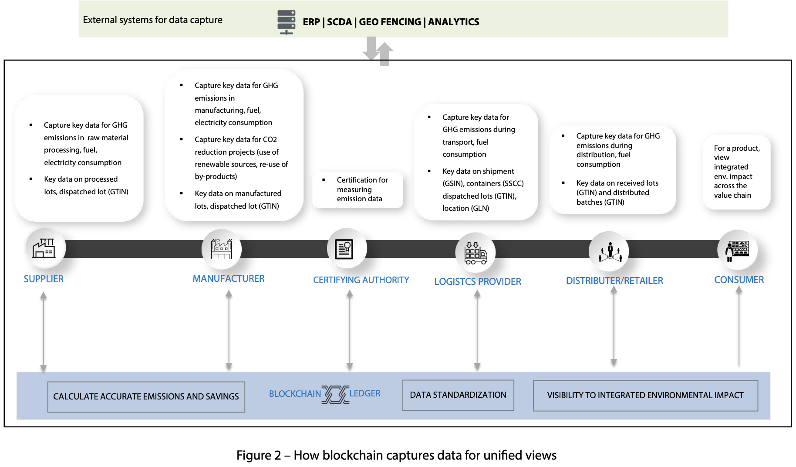
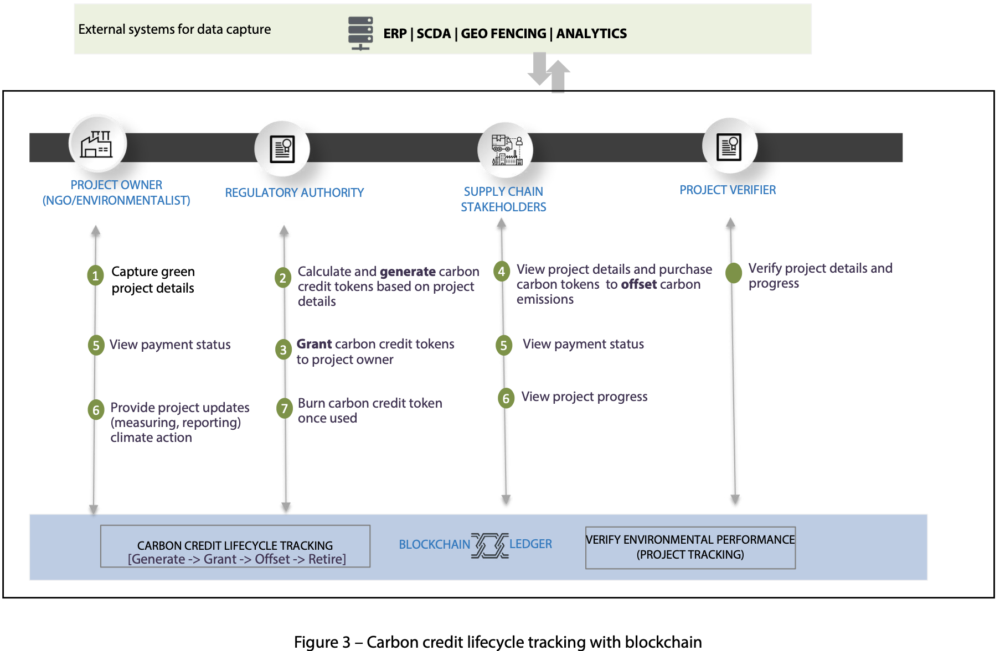
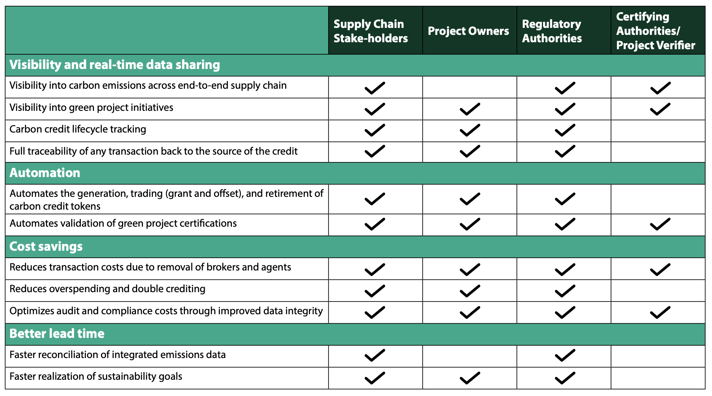

# DigitalCarbonCreditsEcosystem

## Introduction

### Global Sustainability Goals
The 2015 Paris Agreement set in motion a concerted global effort to:
- Meet the sustainability goal of net-zero carbon emissions
- Limit global warming to 1.5 degree Celsius by 2050

As part of this agreement, countries have established:
- Regulations for carbon taxes
- Permissible carbon emissions limits for industries and companies

### Corporate Carbon Initiatives
Many organizations have committed to helping achieve carbon neutrality by 2050:

**Notable Examples:**
- **Arcelor Mittal's Carb™ Green Steel Certificates**
    - Equivalent to carbon credits linked to green projects
    - Allow customers to report equivalent reductions in Scope 3 emissions
    - Comply with the GHG Protocol standards
    
- **Toyota Material Handling Europe**
    - Moving towards a net-zero future
    - Implementing 100% renewable electricity

### Carbon Credits Explained
Individuals and companies can purchase carbon credits through:
- Over-the-counter transactions
- Voluntary carbon markets

**Carbon Credit Sources:**
Carbon credits are generated from various carbon reduction projects:
- Afforestation (planting new trees)
- Reforestation (preventing deforestation)
- Investment in renewable energy

**Types of Carbon Credits:**
- **Certified Emission Reduction (CER)**
    - Offsets project emissions through regulatory frameworks
    
- **Voluntary Emission Reduction (VER)**
    - Contributes towards climate goals and green projects
    - Supports environmental, social, and governance (ESG) purposes

## Digital Carbon Credits Marketplace

### Blockchain-Based Carbon Credit Solutions
Blockchain technology provides an efficient framework for:
- Monitoring carbon emissions against sustainability goals
- Enabling transparent measurement, reporting, and verification of climate action
- Tokenizing carbon credits into tradable digital assets
- Making carbon markets more liquid and accessible to diverse investors

### Key Functionalities

**Carbon Offsets:**
- Blockchain tokens facilitate offsetting carbon emissions
- Individuals and businesses can neutralize their carbon footprint
- Enables purchasing credits from verified green projects
- Contributes to reduction in greenhouse gas emissions

**Carbon Credit Management:**
- **Granting:** Incentivizes companies to reduce emissions by awarding tokenized credits
- **Tracking:** Monitors the complete lifecycle of carbon credits from generation to retirement
- **Retirement:** Ensures credits are properly accounted for and not double-counted

### Benefits of Digital Carbon Credits
- Enhanced transparency and trust in carbon markets
- Reduced transaction costs and intermediaries
- Improved verification of environmental impact
- Greater accessibility for smaller market participants
- Real-time trading and settlement capabilities

